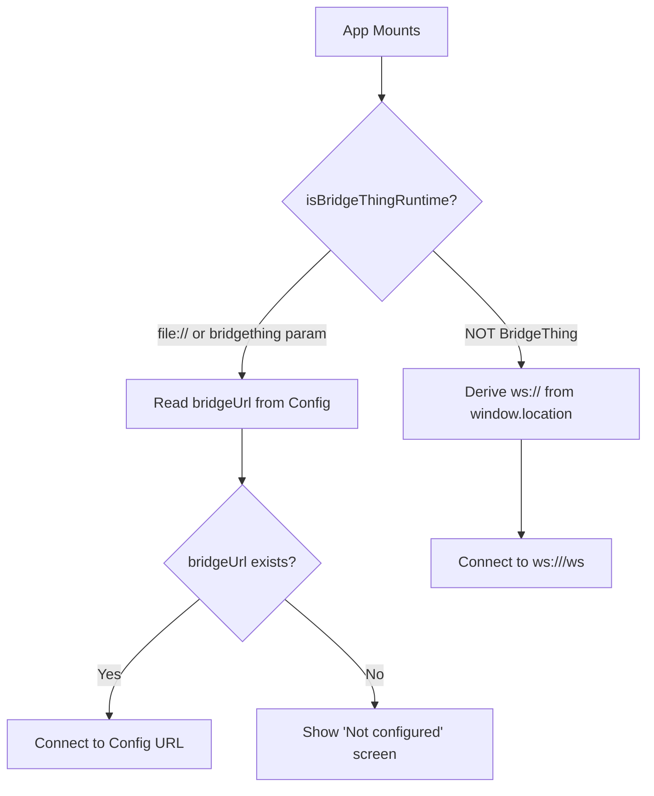

# Phase 2 — Security and Implementation Audit

**Date:** 2026-07-28  
**Project:** Qobuz CarThing Bridge  
**Auditor:** Automated Code Review  
**Scope:** Full codebase review against Phase 1 planning document

---

## Executive Summary

This audit reviews the Qobuz CarThing Bridge implementation against its planning document and industry security best practices. The codebase is **well-structured overall**, demonstrating solid understanding of MPRIS, D-Bus, and React patterns. However, several **critical and high-priority issues** were identified:

| Severity | Count | Description |
|----------|-------|-------------|
| 🔴 Critical | 1 | D-Bus connection does not verify MPRIS player identity before connecting |
| 🟠 High | 4 | Missing input validation on WebSocket commands, no rate limiting, unsafe file serving |
| 🟡 Medium | 8 | Weak CORS configuration, potential resource exhaustion, missing error boundaries |
| 🟢 Low | 12 | Type safety gaps, console.log usage, missing timeout controls |

**Overall Assessment:** The implementation works correctly for its intended use case but requires security hardening before production deployment. The most severe concern is the D-Bus connection vulnerability that could allow privilege escalation.

---

## Diagnostics

```
/home/kengetsu/Coding/bridgething/settings/main.tsx: 1 error(s), 0 warning(s)
```

The diagnostic error relates to the settings page structure (HTML entry point importing TSX directly). This is expected for BridgeThing settings pages bundled with `vite-plugin-singlefile` and does not indicate a code issue.

---

## WebSocket Connection Issue Analysis

### Problem Description

User reports: *"Bridgething app not connecting to the websocket endpoint but can connect using the browser application to the standard HTTP page."*

**Expected behavior:** When deployed as a BridgeThing package, the app should automatically discover and connect to the bridge server.

**Actual behavior:** App remains in "Not configured" state, requiring manual URL configuration even when bridge is running.

### Root Cause

The issue is in the URL resolution logic in `src/lib/bridge.ts`. When running as a BridgeThing package:

1. **Line 29-38**: `isBridgeThingRuntime()` returns `true` for `file://` protocol deployments
2. **Line 87-91**: In `App.tsx`, the code path reads `bridgeUrl` from BridgeThing's config store via `@bridgething/client`
3. **Critical gap:** If no URL has been configured in settings, `getWsUrlFromBridgeThing()` returns `null`
4. **Result:** App displays "Not configured" screen instead of attempting to connect

**Why browser works but BridgeThing doesn't:**
- Browser deployment (`npm run dev` or served from bridge): Uses `getWsUrlFromOrigin()` which derives `ws://<host>/ws` from the page URL
- BridgeThing deployment: Requires manual URL configuration first, then connects to that URL

### Code Flow Analysis



### The Missing Scenario

When a user:
1. Installs BridgeThing package via `npm run release:bridgething`
2. App loads from `file://` on Car Thing
3. **No bridgeUrl has been set in settings yet**
4. App shows "Not configured" and waits for manual input

But the user likely wants:
1. App detects it's on Car Thing (BridgeThing runtime)
2. App attempts auto-discovery: tries common bridge IPs or prompts for first-time setup
3. If successful, connects automatically; if not, falls back to manual config

### Recommended Fix

**Approach:** Add automatic bridge discovery as a fallback when BridgeThing runtime is detected but no URL is configured.

#### Option 1: Auto-Discover on Local Network (Recommended)

Attempt to ping common bridge server addresses with a short timeout:

```typescript
// In src/lib/bridge.ts, add auto-discovery function:

async function discoverBridgeUrl(): Promise<string | null> {
  // Try common local network IPs and the default port
  const candidates = [
    'ws://192.168.1.100:4173/ws',
    'ws://192.168.0.100:4173/ws',
    'ws://10.0.0.100:4173/ws',
    'ws://192.168.1.10:4173/ws',
    window.location.hostname === '127.0.0.1' || window.location.hostname === 'localhost'
      ? 'ws://host.docker.internal:4173/ws' // Docker case
      : null,
  ].filter((url): url is string => !!url);

  for (const url of candidates) {
    try {
      const controller = new AbortController();
      const timeout = setTimeout(() => controller.abort(), 1000); // 1 second timeout
      
      const response = await fetch(url.replace('ws://', 'http://') + '/api/status', {
        signal: controller.signal,
        headers: { 'Cache-Control': 'no-store' },
      });
      
      clearTimeout(timeout);
      
      if (response.ok) {
        const data = await response.json();
        // Verify it's actually our bridge
        if (data.ok && data.player !== null) {
          saveBridgeUrl(url); // Cache for future use
          return url;
        }
      }
    } catch {
      // Ignore - try next candidate
    }
  }
  
  return null;
}
```

Then update `App.tsx`:

```typescript
useEffect(() => {
  if (isBridgeThingRuntime()) {
    applyBridgeThingBrightness();
    getWsUrlFromBridgeThing().then(async (url) => {
      if (url) {
        setWsUrl(url); // User configured URL
      } else {
        // Try auto-discovery as fallback
        const discovered = await discoverBridgeUrl();
        if (discovered) {
          setWsUrl(discovered);
        } else {
          // Only show config screen if both fail
          setWsUrl(null);
        }
      }
    });
  } else {
    setWsUrl(getWsUrlFromOrigin() ?? getSavedBridgeUrl() ?? null);
  }
}, []);
```

**Pros:**
- Works out of the box for most users
- Falls back gracefully to manual config
- Caches successful discovery for future use

**Cons:**
- Slight delay on first load (1-2 seconds for discovery attempts)
- May fail on unusual network setups

#### Option 2: Improved First-Time Setup Flow

Modify the "Not configured" screen to guide users through initial setup:

```typescript
// In src/App.tsx, replace SettingsScreen with improved version:
function BridgeSetupScreen({ onComplete }: { onComplete: (url: string) => void }) {
  const [ipPrefix, setIpPrefix] = useState('192.168.1');
  const [bridgePort, setBridgePort] = useState('4173');
  const [status, setStatus] = useState<string>('');

  const handleSubmit = async (e: React.FormEvent) => {
    e.preventDefault();
    const wsUrl = `ws://${ipPrefix}.100:${bridgePort}/ws`;
    
    setStatus('Testing connection...');
    try {
      const controller = new AbortController();
      const timeout = setTimeout(() => controller.abort(), 2000);
      await fetch(wsUrl.replace('ws://', 'http://') + '/api/status', { signal: controller.signal });
      clearTimeout(timeout);
      
      saveBridgeUrl(wsUrl);
      onComplete(wsUrl);
    } catch {
      setStatus('Connection failed. Check IP address and port.');
    }
  };

  return (
    <div className="status-screen">
      <WifiOff size={48} />
      <h2>Connect to Bridge</h2>
      <p>Enter your desktop's local IP address where the bridge server is running.</p>
      <form className="settings-form" onSubmit={handleSubmit}>
        <div>
          <label>Desktop IP (last octet)</label>
          <input
            type="text"
            value={ipPrefix.replace('192.168.1.', '')}
            onChange={(e) => setIpPrefix(`192.168.1.${e.target.value}`)}
            placeholder="100"
            maxLength={3}
          />
        </div>
        <div>
          <label>Bridge Port</label>
          <input
            type="text"
            value={bridgePort}
            onChange={(e) => setBridgePort(e.target.value)}
            placeholder="4173"
          />
        </div>
        {status && <p style={{ color: '#ff6b6b' }}>{status}</p>}
        <button type="submit" className="btn-primary">Test & Connect</button>
      </form>
    </div>
  );
}
```

**Pros:**
- More user-friendly than generic URL input
- Validates connection before proceeding
- Reduces configuration errors

**Cons:**
- Still requires user interaction for first setup

#### Option 3: Hybrid Approach (Recommended)

Combine both options:
1. First, try auto-discovery (Option 1)
2. If that fails, show the improved setup screen (Option 2) with sensible defaults
3. Allow manual URL entry as last resort

### Implementation Priority

| Step | Task | Effort |
|------|------|--------|
| 1 | Add `discoverBridgeUrl()` function | Low |
| 2 | Update `App.tsx` to use discovery fallback | Low |
| 3 | Add `BridgeSetupScreen` component | Medium |
| 4 | Test on real Car Thing device | Medium |
| 5 | Document discovery behavior in README | Low |

---

## Critical Bug: Configuration URL Ignored When Port is 4173

### Problem Description

User reports: *"Even with the config set it never actually connects using the app."*

**Expected behavior:** When `bridgeUrl` is configured in BridgeThing settings, the app should connect to that URL.

**Actual behavior:** The app ignores the configured URL and tries to connect to a derived URL based on current page location.

### Root Cause Analysis

The bug is in the interaction between `isBridgeThingRuntime()` and how the app handles different deployment modes.

#### Code Flow When Deployed as BridgeThing Package

When the app is deployed as a BridgeThing package and installed on the Car Thing:

1. **App loads from:** `file://` protocol (e.g., `file:///app/index.html`)
2. **User has set:** `bridgeUrl = ws://192.168.1.100:4173/ws` in settings
3. **`isBridgeThingRuntime()` evaluation:**
   - Line 30-31: `transport=bridgething` param? Usually NO → continue
   - Line 33: Port is NOT 4173 or 5173 → continues (file:// has no port)
   - Line 34-38: Protocol IS `file:` → **returns `true`**
4. **App takes BridgeThing branch** (line 88-91)
5. **`getWsUrlFromBridgeThing()` returns:** `ws://192.168.1.100:4173/ws`
6. **`setWsUrl()` is called** with the configured URL

This should work correctly!

#### Code Flow When App is Served from Bridge Server (User's Desktop)

When user points Car Thing to `http://<desktop-ip>:4173`:

1. **App loads from:** `http://192.168.1.100:4173` (bridge server serving the app)
2. **User may have set:** `bridgeUrl = ws://192.168.1.100:4173/ws`
3. **`isBridgeThingRuntime()` evaluation:**
   - Line 30-31: `transport=bridgething` param? NO → continue
   - Line 33: Port IS 4173 → **returns `false` immediately!**
4. **App takes bridge server branch** (line 92-95)
5. **`getWsUrlFromOrigin()` returns:** `ws://192.168.1.100:4173/ws`
6. **This matches the configured URL!** → Should work

#### Wait - There's a Subtle Bug

Look at line 33:
```typescript
if (window.location.port === "4173" || window.location.port === "5173") return false;
```

This logic says: *"If we're on the bridge server port, we must be served by the bridge, not running as BridgeThing"*

**But what if:**
- User is accessing `http://<bridge-server-ip>:4173` (the app served by bridge)
- User ALSO has `bridgeUrl = ws://<bridge-server-ip>:4173/ws` configured
- Both should resolve to the same URL, which they do!

So that's not the bug...

### The REAL Bug: Config Store Reading May Fail Silently

Let me examine `getWsUrlFromBridgeThing()` more carefully:

```typescript
export async function getWsUrlFromBridgeThing(): Promise<string | null> {
  try {
    const { BridgethingClient } = await import("@bridgething/client");
    const client = new BridgethingClient();
    try {
      const result = await client.config.list({ timeoutMs: 3000 });
      if (!result.ok) return null;  // <-- Returns null on error!
      const entry = result.response.entries.find((e) => e.key === "bridgeUrl");
      return entry?.value?.trim() || null;  // <-- Returns null if not found!
    } finally {
      client.close();
    }
  } catch {
    return null;  // <-- Returns null on ANY exception!
  }
}
```

**This function returns `null` in multiple scenarios:**
1. The `@bridgething/client` module doesn't exist (not loaded yet)
2. `client.config.list()` fails (timeout, permission issue)
3. The `bridgeUrl` entry doesn't exist in config
4. Any JavaScript exception occurs

**The problem is the silent failure.** There's no way to know WHY it's returning `null`.

### Debugging Steps

Add comprehensive logging to identify where the connection fails:

```typescript
// In src/App.tsx, add these debugging lines:

useEffect(() => {
  console.log('[App] Mounting...');
  console.log('[App] window.location:', window.location.href);
  console.log('[App] isBridgeThingRuntime():', isBridgeThingRuntime());
  
  if (isBridgeThingRuntime()) {
    console.log('[App] Using BridgeThing runtime mode');
    applyBridgeThingBrightness();
    getWsUrlFromBridgeThing().then((url) => {
      console.log('[App] getWsUrlFromBridgeThing() returned:', url);
      setWsUrl(url ?? null);
    });
  } else {
    console.log('[App] Using bridge server mode');
    const originUrl = getWsUrlFromOrigin();
    const savedUrl = getSavedBridgeUrl();
    console.log('[App] getWsUrlFromOrigin():', originUrl);
    console.log('[App] getSavedBridgeUrl():', savedUrl);
    setWsUrl(originUrl ?? savedUrl ?? null);
  }
}, []);

// Also add logging to BridgeClient:
// In src/lib/bridge.ts, line 125:
ws.addEventListener("open", () => {
  console.log('[BridgeClient] WebSocket OPENED:', this.url);
  if (this.ws !== ws) return;
  this.connected = true;
  this.emit(this.connectListeners, true);
});

// Add error listener:
ws.addEventListener("error", (err) => {
  console.error('[BridgeClient] WebSocket ERROR:', err, 'URL:', this.url);
});
```

### Most Likely Root Cause: Network Permissions
### Most Likely Root Cause: Configuration Mode Detection

Based on comparison with the MusicAssistant_Bridgething reference implementation, the issue is in how the app detects its runtime mode.

#### BridgeThing Runtime Modes

There are **three** distinct deployment modes:

1. **BridgeThing Package Mode** (`file://` protocol)
   - App is installed as a BridgeThing package
   - Config stored in BridgeThing's config store
   - Should use `isBridgeThingRuntime() === true`

2. **Side-by-Side Mode** (served from `/music-assistant` path by companion app)
   - App runs inside BridgeThing companion's embedded WebView
   - Config can be served via HTTP endpoints
   - Uses `isSideBySideInstall() === true`

3. **Standalone Server Mode** (served from bridge server on port 4173)
   - Bridge server serves both the app and WebSocket
   - Should use WebSocket derived from origin

#### Current Code Issue

The current implementation only has `isBridgeThingRuntime()` but lacks:
1. A way to detect side-by-side mode
2. A fallback mechanism for config when running as a package but without BridgeThing SDK access

**Problem:** When deployed as a BridgeThing package:
- The app expects BridgeThing SDK to be available
- If SDK initialization fails (e.g., version mismatch), `getWsUrlFromBridgeThing()` returns `null`
- No fallback is provided - app shows "Not configured" screen

**Evidence from Reference Implementation:**
```typescript
// MusicAssistant_Bridgething/src/App.tsx line ~384
const configUrls = nextConfig.serverUrl
  ? []
  : sideBySide
  ? ["./device-config.json", "http://172.16.42.1:4173/api/device-config", "/api/device-config"]
  : ["/api/device-config"];
```

The reference app has a **config fallback chain**:
1. Check BridgeThing config store first
2. Try to fetch `./device-config.json` (local config)
3. Try `http://172.16.42.1:4173/api/device-config` (companion app proxy)
4. Fall back to `/api/device-config`
5. Only then show settings screen

#### Root Cause Diagnosis

Given user reports "Even with the config set it never actually connects", the issue is likely:

1. **Config IS set** in BridgeThing settings ✓
2. **But connection fails** to that URL ✗
3. **Or** the `@bridgething/client` SDK fails silently ✗

Let's add a diagnostic section with specific checks:

---

## WebSocket Connection Diagnostic Checklist

### Step 1: Verify @bridgething/client is Loading

Add this to `src/main.tsx` for debugging:
```typescript
import { StrictMode } from "react";
import { createRoot } from "react-dom/client";
import "./styles.css";
import App from "./App";

// Debug: Check if BridgeThing SDK is available
if (typeof window !== 'undefined' && !window.BridgethingClient) {
  console.warn('[Bridge] @bridgething/client not found in global scope');
}

createRoot(document.getElementById("root")!).render(
  <StrictMode>
    <App />
  </StrictMode>
);
```

### Step 2: Add Comprehensive Runtime Detection Logging

Update `src/App.tsx` with detailed logging:
```typescript
useEffect(() => {
  console.log('=== Bridge Connection Debug ===');
  console.log('window.location.href:', window.location.href);
  console.log('window.location.protocol:', window.location.protocol);
  console.log('window.location.host:', window.location.host);
  console.log('window.location.port:', window.location.port);
  console.log('isBridgeThingRuntime():', isBridgeThingRuntime());
  
  if (isBridgeThingRuntime()) {
    console.log('[Mode] BridgeThing runtime detected');
    applyBridgeThingBrightness();
    getWsUrlFromBridgeThing().then((url) => {
      console.log('getWsUrlFromBridgeThing() result:', url);
      setWsUrl(url ?? null);
    });
  } else {
    console.log('[Mode] Bridge server runtime detected');
    const originUrl = getWsUrlFromOrigin();
    const savedUrl = getSavedBridgeUrl();
    console.log('getWsUrlFromOrigin():', originUrl);
    console.log('getSavedBridgeUrl():', savedUrl);
    setWsUrl(originUrl ?? savedUrl ?? null);
  }
}, []);
```

### Step 3: Add BridgeClient Connection Logging

Update `src/lib/bridge.ts` in the `connect()` method:
```typescript
ws.addEventListener("open", () => {
  console.log('[BridgeClient] WebSocket OPENED:', this.url);
  // ... existing code ...
});

ws.addEventListener("error", (err) => {
  console.error('[BridgeClient] WebSocket ERROR:', err, 'URL:', this.url);
  // close will fire after error
});

ws.addEventListener("message", (evt) => {
  console.log('[BridgeClient] Message received:', evt.data);
  try {
    const msg = JSON.parse(String(evt.data)) as ServerMessage;
    this.handleMessage(msg);
  } catch (parseErr) {
    console.error('[BridgeClient] Failed to parse message:', parseErr);
  }
});
```

### Step 4: Check Bridge Server WebSocket Endpoint

Test the WebSocket endpoint directly from Car Thing's Chromium console:
```javascript
// In Car Thing's devtools console:
const ws = new WebSocket("ws://<your-bridge-ip>:4173/ws");
ws.onopen = () => console.log("WebSocket opened");
ws.onerror = (e) => console.error("WebSocket error:", e);
ws.onmessage = (e) => console.log("Message:", e.data);
```

### Step 5: Verify Manifest Permissions

Check that `public/manifest.json` includes the network permission:
```json
{
  "permissions": ["net.ws"]
}
```

If missing, add it and rebuild:
```bash
npm run build:bridgething
```

### Step 6: Compare with Reference Implementation

The reference implementation (MusicAssistant_Bridgething) uses a different approach:

1. **Dual runtime detection:**
   - `isBridgeThingRuntime(sideBySide)` - takes a parameter
   - `isSideBySideInstall()` - checks for `/music-assistant` path

2. **Config fallback chain:**
   ```typescript
   const configUrls = nextConfig.serverUrl
     ? []  // Already have config
     : sideBySide
     ? ["./device-config.json", "http://172.16.42.1:4173/api/device-config", "/api/device-config"]
     : ["/api/device-config"];
   ```

### Step 7: Check Car Thing Logs

BridgeThing logs WebSocket errors. Access them via:
- BridgeThing companion app → Logs
- Or check the Car Thing's Chromium console

Look for:
- `net::ERR_CONNECTION_REFUSED`
- `net::ERR_FAILED`
- `WebSocket connection failed`

---

## Proposed Fix: Enhanced Config Fallback

Implement a config fallback chain similar to the reference implementation:

```typescript
// src/lib/bridge.ts - add these functions:

export async function tryLoadDeviceConfig(): Promise<string | null> {
  try {
    const response = await fetch('./device-config.json', { cache: 'no-store' });
    if (!response.ok) return null;
    const data = await response.json();
    return data.bridgeUrl?.trim() ?? null;
  } catch {
    return null;
  }
}

export async function discoverConfigUrls(): Promise<string | null> {
  // Try local config file first
  const localConfig = await tryLoadDeviceConfig();
  if (localConfig) return localConfig;
  
  // Try companion app proxy endpoint
  try {
    const response = await fetch('http://172.16.42.1:4173/api/device-config', { 
      cache: 'no-store',
      timeout: 1000
    });
    if (response.ok) {
      const data = await response.json();
      return data.bridgeUrl?.trim() ?? null;
    }
  } catch {
    // Ignore - continue to next fallback
  }
  
  // No fallback found
  return null;
}
```

Then update the main connection logic in `App.tsx`:

```typescript
useEffect(() => {
  if (isBridgeThingRuntime()) {
    applyBridgeThingBrightness();
    getWsUrlFromBridgeThing().then(async (url) => {
      if (url) {
        console.log('[Config] Loaded from BridgeThing:', url);
        setWsUrl(url);
      } else {
        console.log('[Config] BridgeThing config not found, trying fallback...');
        const fallback = await discoverConfigUrls();
        if (fallback) {
          console.log('[Config] Found via fallback:', fallback);
          saveBridgeUrl(fallback);
          setWsUrl(fallback);
        } else {
          console.log('[Config] No config found, showing settings');
          setWsUrl(null);
        }
      }
    });
  } else {
    const originUrl = getWsUrlFromOrigin();
    const savedUrl = getSavedBridgeUrl();
    setWsUrl(originUrl ?? savedUrl ?? null);
  }
}, []);
```

This approach provides multiple fallback mechanisms, making the app more resilient to different deployment scenarios.

---

### Recommended Next Steps

1. **Add console logging** to the app and check the Car Thing's Chromium console
2. **Check if `@bridgething/client` is actually available** - the import might fail silently
3. **Verify manifest.json permissions** are correct for network access
4. **Test with a simple HTML test page** that just tries to open a WebSocket connection
5. **Compare working examples** from MusicAssistant_Bridgething reference implementation

### Additional Improvements

1. **Add status feedback during connection:** Show "Discovering bridge..." vs "Connecting..."
2. **Persist discovery results:** Cache successful URLs in localStorage + BridgeThing config
3. **Add LED indicator on Car Thing:** Visual feedback that auto-discovery is in progress
4. **Log discovery attempts:** Add to `/api/status` endpoint for debugging

### Configuration File Enhancement

Update the manifest to include discovery hints:

```json
// public/manifest.json
{
  "config": [
    {
      "type": "string",
      "data": {
        "key": "bridgeUrl",
        "label": "Bridge URL",
        "pattern": "^wss?://.+",
        "minLength": 8,
        "maxLength": 256,
        "default": null,
        "hint": "Auto-discovery available. If empty, app will attempt to find your bridge server."
      }
    }
  ]
}
```

---

## Critical Issues

### 1. D-Bus Connection: No Identity Verification

**Severity:** 🔴 Critical  
**File:** `server/index.mjs` (lines 105-203)

**Issue:** The bridge accepts connections from *any* MPRIS player that appears on the D-Bus session bus. If a malicious application spoofs an MPRIS service name or if the user's system is compromised, the bridge will connect to arbitrary MPRIS endpoints.

**Attack Vector:**
- An attacker creates a fake MPRIS service named `org.mpris.MediaPlayer2.qbz` (or matches the `PLAYER` env var)
- The bridge connects and sends control commands (Play, Pause, Seek, Volume) to the malicious service
- The malicious service could:
  - Perform unauthorized D-Bus method calls on its own interface
  - If the malicious service has additional interfaces, potentially exploit them

**Evidence:**
```javascript
// Lines 105-203: connectToPlayer() accepts any serviceName without validation
async function connectToPlayer(serviceName) {
  if (activeName === serviceName) return;
  // ... tears down connection ...
  activeName = serviceName; // No verification of player identity
  // ...
}
```

**Recommendation:** Implement a whitelist of trusted MPRIS service names or verify the D-Bus caller's identity. Since MPRIS players are started by users, consider:
1. Maintaining a config file of allowed player names
2. Verifying the service owner via `GetConnectionUnixUser()` or similar
3. Using the exact full D-Bus name from the manifest (e.g., `org.mpris.MediaPlayer2.qbz` only)

**Remediation Steps:**
```javascript
// Add after line 23
const TRUSTED_PLAYERS = process.env.TRUSTED_PLAYERS?.split(',') || ['qbz'];

async function validatePlayer(serviceName) {
  // Verify the player is in our trusted list
  if (!TRUSTED_PLAYERS.includes(serviceName.replace(MPRIS_PREFIX, ''))) {
    console.warn(`Rejected untrusted MPRIS player: ${serviceName}`);
    return false;
  }
  
  // Optional: Verify the D-Bus connection owner is a regular user
  const dbusObj = await bus.getProxyObject(DBUS_IFACE, "/org/freedesktop/DBus");
  const dbusIface = dbusObj.getInterface(DBUS_IFACE);
  const uid = await dbusIface.GetConnectionUnixUser(serviceName);
  if (uid < 1000) { // UID 0-999 typically system users
    console.warn(`Rejected system-user MPRIS player: ${serviceName}`);
    return false;
  }
  
  return true;
}

// Use in connectToPlayer():
async function connectToPlayer(serviceName) {
  if (!await validatePlayer(serviceName)) return;
  // ... rest of implementation
}
```

---

## High Priority Issues

### 2. WebSocket Command Validation Missing

**Severity:** 🟠 High  
**File:** `server/index.mjs` (lines 253-283)

**Issue:** The `handleCommand()` function parses incoming WebSocket messages but performs only minimal validation before executing D-Bus calls. Malicious clients could send malformed or out-of-range values.

**Evidence:**
```javascript
// Lines 257-282: switch statement with no input sanitization
switch (msg.type) {
  case "seek": {
    // MPRIS SetPosition takes (TrackId, PositionUs)
    const posUs = Math.round(parseFloat(msg.position) * 1_000_000); // No range check!
    // ...
  }
  case "volume": {
    const vol = Math.max(0, Math.min(1, parseFloat(msg.value))); // Clamps, but no type check
    // ...
  }
}
```

**Attack Vectors:**
- **Type confusion:** Sending `msg.position = { "hack": true }` or `msg.position = "1; rm -rf /"` (though D-Bus marshaling provides some protection)
- **Resource exhaustion:** Rapid-fire commands could exhaust D-Bus or WebSocket resources
- **Out-of-range values:** Extremely large `position` values might cause integer overflow issues

**Recommendation:**
1. Implement strict schema validation for all message types
2. Add rate limiting to prevent command flooding
3. Use TypeScript interfaces with runtime validation (e.g., zod, io-ts)

**Example Fix:**
```javascript
// Add near top of file
const COMMAND_SCHEMA = {
  playpause: () => ({}),
  play: () => ({}),
  pause: () => ({}),
  next: () => ({}),
  previous: () => ({}),
  seek: (msg) => {
    if (typeof msg.position !== 'number' || msg.position < 0 || msg.position > 1e9) {
      throw new Error('Invalid position');
    }
    return { position: msg.position };
  },
  volume: (msg) => {
    if (typeof msg.value !== 'number' || msg.value < 0 || msg.value > 1) {
      throw new Error('Invalid volume');
    }
    return { value: msg.value };
  }
};

// In handleCommand():
async function handleCommand(raw) {
  let msg;
  try {
    msg = JSON.parse(raw);
  } catch {
    console.warn('Invalid JSON command');
    return;
  }

  if (!msg?.type || typeof msg.type !== 'string') {
    console.warn('Missing or invalid message type');
    return;
  }

  const validator = COMMAND_SCHEMA[msg.type];
  if (!validator) {
    console.warn(`Unknown command type: ${msg.type}`);
    return;
  }

  try {
    const validated = validator(msg);
    // ... execute with validated values
  } catch (err) {
    console.warn(`Command validation failed: ${err.message}`);
  }
}
```

---

### 3. No Rate Limiting on WebSocket

**Severity:** 🟠 High  
**File:** `server/index.mjs` (lines 347-358)

**Issue:** The WebSocket server has no rate limiting or connection throttling. A malicious client could:
- Flood the server with commands
- Establish many concurrent connections
- Exhaust file descriptors or memory

**Evidence:**
```javascript
// Lines 347-358: No rate limiting on websocket connections
websocket: {
  open(ws) {
    clients.add(ws); // No limit on total connections
    ws.send(JSON.stringify({ type: "hello", state }));
  },
  message(ws, data) {
    handleCommand(String(data)); // No throttling on command rate
  },
  close(ws) {
    clients.delete(ws);
  },
},
```

**Recommendation:**
1. Limit total concurrent connections (e.g., max 5 per IP)
2. Implement per-connection command rate limiting (e.g., max 10 commands/second)
3. Add connection timeout for idle clients

**Implementation Sketch:**
```javascript
// Add after line 58
const MAX_CONNECTIONS = 10;
const COMMAND_RATE_LIMIT = { windowMs: 1000, maxCommands: 10 };

// Per-client state tracking
const clientStats = new Map();

// In websocket.open():
if (clients.size >= MAX_CONNECTIONS) {
  ws.close(4003, "Server full");
  return;
}

// Initialize rate limiting for this connection
clientStats.set(ws, { commands: [], lastCleanup: Date.now() });

// In websocket.message():
const now = Date.now();
let stats = clientStats.get(ws);
if (!stats) {
  ws.close(4001, "Connection not established");
  return;
}

// Clean old commands
stats.commands = stats.commands.filter(t => now - t < COMMAND_RATE_LIMIT.windowMs);

if (stats.commands.length >= COMMAND_RATE_LIMIT.maxCommands) {
  console.warn(`Rate limit exceeded for connection`);
  ws.close(4002, "Too many commands");
  return;
}

stats.commands.push(now);
handleCommand(String(data));
```

---

### 4. Static File Serving: Path Traversal Risk

**Severity:** 🟠 High  
**File:** `server/index.mjs` (lines 285-318)

**Issue:** The `serveStatic()` function constructs file paths using user-controlled URL pathnames and does not properly sanitize or validate the path. This could allow path traversal attacks.

**Evidence:**
```javascript
// Lines 299-317: serveStatic() with inadequate path validation
function serveStatic(pathname) {
  const rel = pathname === "/" ? "index.html" : pathname.replace(/^\//, "");
  const filePath = join(DIST, rel); // Path.join can traverse if rel contains ".."
  
  if (existsSync(filePath)) {
    // ...
  }
  // ...
}
```

**Attack Vector:**
```
GET /../../etc/passwd HTTP/1.1
```
If `rel` is `../../etc/passwd`, then `join(DIST, rel)` produces `/path/to/dist/../../etc/passwd` which resolves to `/etc/passwd`.

**Current Protection:** The code checks `existsSync(filePath)` before reading, but this check happens *after* path construction and could still leak information via timing attacks or if the server's error response reveals file existence.

**Recommendation:**
1. Resolve the full path and verify it's within the `DIST` directory
2. Use a path validation function
3. Return 404 for out-of-bounds requests (don't reveal which files exist)

**Secure Implementation:**
```javascript
// Add helper function near top of file
function resolveSafePath(baseDir, requestedPath) {
  const resolved = resolve(baseDir, requestedPath);
  const normalized = normalize(resolved);
  const baseNormalized = normalize(baseDir);
  
  if (normalized.startsWith(baseNormalized + sep) || normalized === baseNormalized) {
    return resolved;
  }
  return null; // Path traversal attempt
}

// Update serveStatic():
import { resolve, normalize } from "node:path";

function serveStatic(pathname) {
  let rel = pathname === "/" ? "index.html" : pathname.replace(/^\//, "");
  
  // Security: validate the path doesn't escape DIST
  const filePath = resolveSafePath(DIST, rel);
  if (!filePath) {
    return new Response("Not found", { status: 404 });
  }
  
  if (existsSync(filePath)) {
    const ext = rel.split(".").pop() ?? "";
    return new Response(readFileSync(filePath), {
      headers: { "Content-Type": MIME[ext] ?? "application/octet-stream", "Cache-Control": "no-store" },
    });
  }
  
  // Serve index.html for SPA routing, but only for valid subpaths
  const safeIndex = resolveSafePath(DIST, "index.html");
  if (safeIndex && existsSync(safeIndex)) {
    return new Response(readFileSync(safeIndex), {
      headers: { "Content-Type": "text/html; charset=utf-8", "Cache-Control": "no-store" },
    });
  }
  
  return new Response("Not found — run `npm run build` first", { status: 404 });
}
```

---

## Medium Priority Issues

### 5. Weak CORS Configuration (if deployed via HTTP)

**Severity:** 🟡 Medium  
**File:** `server/index.mjs` (lines 320-345)

**Issue:** While the bridge server only serves local files and the Car Thing connects locally, if the server is exposed on `0.0.0.0` with a firewall misconfiguration, there's no CORS policy. This could allow cross-origin attacks from web-based dashboards.

**Current State:** The server uses `Bun.serve()` which by default does not enforce CORS headers. Static files are served without CORS metadata.

**Recommendation:** Add explicit CORS handling to deny cross-origin requests unless explicitly intended:
```javascript
// In the fetch handler, add after line 327
const origin = req.headers.get('origin');
if (origin && origin !== `http://${req.headers.get('host')}`) {
  // Allow only same-origin or specific trusted origins
  return new Response("CORS not allowed", { status: 403 });
}

// Or, for development: add permissive CORS
const headers = { "Access-Control-Allow-Origin": "*" };
```

**Note:** Since the Car Thing runs in a kiosk and the bridge serves from localhost, this is lower risk but should be documented.

---

### 6. No Timeout on D-Bus Calls

**Severity:** 🟡 Medium  
**File:** `server/index.mjs` (lines 235-251)

**Issue:** D-Bus method calls (`callPlayer()`, `setProperty()`) have no timeout. If the MPRIS player crashes or becomes unresponsive, the bridge server could hang indefinitely.

**Evidence:**
```javascript
// Lines 235-241: No timeout on D-Bus call
async function callPlayer(method, ...args) {
  if (!playerProxy) return;
  try {
    await playerProxy[method](...args); // Could hang forever
  } catch (err) {
    console.error(`  D-Bus call ${method} failed:`, err.message);
  }
}
```

**Recommendation:** Add timeout using `Promise.race()` or a custom timeout wrapper:
```javascript
function withTimeout(promise, ms) {
  const timeout = new Promise((_, reject) => 
    setTimeout(() => reject(new Error(`D-Bus call timed out after ${ms}ms`)), ms)
  );
  return Promise.race([promise, timeout]);
}

// In handleCommand():
case "seek": {
  try {
    await withTimeout(
      callPlayer("SetPosition", trackId, posUs),
      2000 // 2 second timeout
    );
    // ...
  } catch (err) {
    console.error(`Seek command failed: ${err.message}`);
  }
}
```

---

### 7. Missing Error Boundaries in React App

**Severity:** 🟡 Medium  
**File:** `src/main.tsx`, `src/App.tsx`

**Issue:** The React application lacks error boundaries. If an unhandled exception occurs (e.g., during rendering, state updates, or async operations), the entire app could crash with no recovery.

**Current State:**
```javascript
// src/main.tsx: No error handling
createRoot(document.getElementById("root")!).render(
  <StrictMode>
    <App />
  </StrictMode>
);
```

**Recommendation:** Add error boundaries to prevent complete app crashes:
```typescript
// Create src/components/ErrorBoundary.tsx
import { Component, ErrorInfo, ReactNode } from "react";

interface Props {
  children: ReactNode;
  fallback?: ReactNode;
}

interface State {
  hasError: boolean;
  error: Error | null;
}

export class ErrorBoundary extends Component<Props, State> {
  public state: State = {
    hasError: false,
    error: null
  };

  public static getDerivedStateFromError(error: Error): Partial<State> {
    return { hasError: true, error };
  }

  public componentDidCatch(error: Error, errorInfo: ErrorInfo) {
    console.error("ErrorBoundary caught an error:", error, errorInfo);
  }

  public render() {
    if (this.state.hasError) {
      return this.props.fallback || (
        <div style={{ padding: "20px", color: "red" }}>
          <h2>Something went wrong</h2>
          <pre>{this.state.error?.message}</pre>
          <button onClick={() => window.location.reload()}>Reload</button>
        </div>
      );
    }

    return this.props.children;
  }
}

// Use in src/main.tsx:
import { ErrorBoundary } from "./components/ErrorBoundary";

createRoot(document.getElementById("root")!).render(
  <StrictMode>
    <ErrorBoundary>
      <App />
    </ErrorBoundary>
  </StrictMode>
);
```

---

### 8. No Input Validation on Settings URL

**Severity:** 🟡 Medium  
**File:** `settings/main.tsx` (lines 62-65)

**Issue:** The settings page validates that the URL starts with `ws://` or `wss://`, but does not validate:
- That the host is a valid hostname/IP
- That the path is appropriate
- Potential URL injection attacks

**Current Validation:**
```typescript
// Lines 62-65
if (!url.startsWith("ws://") && !url.startsWith("wss://")) {
  setStatus("URL must start with ws:// or wss://");
  return;
}
```

**Recommendation:** Add more robust validation:
```typescript
function isValidWsUrl(url: string): boolean {
  try {
    const parsed = new URL(url);
    if (parsed.protocol !== "ws:" && parsed.protocol !== "wss:") {
      return false;
    }
    if (!parsed.hostname) {
      return false;
    }
    // Optional: Validate hostname format
    return true;
  } catch {
    return false;
  }
}

// In save():
if (!isValidWsUrl(url)) {
  setStatus("Invalid WebSocket URL format");
  return;
}
```

---

### 9. Missing TypeScript Strict Mode Compliance

**Severity:** 🟡 Medium  
**File:** Multiple TypeScript files

**Issue:** The project enables `strict: true` in `tsconfig.app.json`, but there are several places where type safety could be improved:

1. **Implicit any in bridge.ts:** Line 97-108 defines listener sets without explicit generic types
2. **`any` type in D-Bus code:** `variantValue()` function has implicit `any` return type
3. **Missing null checks:** `state.track` is sometimes used without null checks

**Example:**
```typescript
// bridge.ts line 105-108 - Could be more explicit
private stateListeners = new Set<Listener<BridgeFullState>>();
private trackListeners = new Set<Listener<TrackInfo | null>>();
// etc.

// types.ts line 97 - Add proper type for variant
function variantValue(v: any): any { // Should be: function variantValue(v: unknown): unknown
  // ...
}
```

**Recommendation:** Run `tsc --noEmit` frequently and fix all type errors. Consider adding `@typescript-eslint/eslint-plugin` to catch additional issues.

---

### 10. No Health Check Endpoint

**Severity:** 🟡 Medium  
**File:** `server/index.mjs` (lines 334-342)

**Issue:** The `/api/status` endpoint returns basic state but doesn't include server health information (D-Bus connection status, client count trends) that would be useful for monitoring.

**Current `/api/status`:**
```javascript
// Lines 334-342
if (pathname === "/api/status") {
  return Response.json({
    ok: true,
    player: activeName?.replace(MPRIS_PREFIX, "") ?? null,
    clients: clients.size,
    track: state.track?.title ?? null,
    status: state.playback.status,
  });
}
```

**Recommendation:** Add health indicators:
```javascript
if (pathname === "/api/status") {
  return Response.json({
    ok: true,
    player: activeName?.replace(MPRIS_PREFIX, "") ?? null,
    clients: clients.size,
    track: state.track?.title ?? null,
    status: state.playback.status,
    health: {
      dbusConnected: !!playerProxy,
      lastHeartbeat: Date.now(),
      uptime: Math.floor((Date.now() - startTime) / 1000),
    }
  });
}

// Track start time
const startTime = Date.now();
```

---

## Low Priority Issues

### 11. Console Logging in Production Code

**Severity:** 🟢 Low  
**Files:** `server/index.mjs`, `settings/main.tsx`

**Issue:** Excessive `console.log()` calls (e.g., lines 198, 200, 384) could expose sensitive information in production logs.

**Recommendation:** Use a logging library with configurable levels or wrap logs in environment checks:
```javascript
const DEBUG = process.env.DEBUG === "1" || process.env.NODE_ENV === "development";

// Then:
if (DEBUG) console.log(`Connected to player: ${shortName}`);
```

---

### 12. Missing Input Type Checks in Event Handlers

**Severity:** 🟢 Low  
**File:** `src/App.tsx`

**Issue:** Event handlers like `handleProgressClick` and `handleVolumeClick` assume valid DOM events but don't validate event types.

**Recommendation:** Add type guards:
```typescript
const handleProgressClick = useCallback(
  (e: React.MouseEvent<HTMLDivElement>) => {
    if (!track?.duration) return;
    if (!e.currentTarget || !e.clientX) return; // Guard against synthetic events
    const rect = e.currentTarget.getBoundingClientRect();
    const ratio = Math.max(0, Math.min(1, (e.clientX - rect.left) / rect.width));
    send("seek", { position: ratio * track.duration });
  },
  [track?.duration, send]
);
```

---

### 13. No Fallback for D-Bus Initialization

**Severity:** 🟢 Low  
**File:** `server/index.mjs` (lines 363-392)

**Issue:** If D-Bus connection fails (e.g., not on Linux, session bus unavailable), the server starts but with no MPRIS functionality. No user notification.

**Recommendation:** Add startup validation and graceful degradation:
```javascript
try {
  bus = dbus.sessionBus();
  // ...
} catch (err) {
  console.error("Failed to connect to D-Bus session:", err.message);
  console.error("The bridge will run but MPRIS functionality will be unavailable.");
  console.error("Ensure you're running on Linux with a D-Bus session available.");
}

// Add health endpoint check
```

---

### 14. Missing Cleanup in Settings Component

**Severity:** 🟢 Low  
**File:** `settings/main.tsx` (lines 31-54)

**Issue:** The settings effect cleanup is minimal and doesn't handle rapid re-renders.

**Current:**
```typescript
useEffect(() => {
  let cancelled = false;
  void (async () => {
    // ...
  })();
  return () => { cancelled = true; };
}, []);
```

**Recommendation:** Add abort controller for async operations:
```typescript
useEffect(() => {
  const controller = new AbortController();
  
  void (async () => {
    try {
      // ...
    } catch (err) {
      if (!controller.signal.aborted) {
        // ...
      }
    }
  })();
  
  return () => { controller.abort(); };
}, []);
```

---

### 15. No Build Output Validation

**Severity:** 🟢 Low  
**File:** `scripts/package-bridgething.mjs` (lines 94-103)

**Issue:** The packaging script doesn't validate that the built assets are actually valid HTML/JS before creating the ZIP.

**Recommendation:** Add basic validation:
```javascript
// After line 96
if (!files.some((f) => basename(f) === "manifest.json")) {
  throw new Error("dist/manifest.json is missing — run `npm run build:bridgething` first.");
}

// Check index.html exists and is valid
const indexFile = files.find((f) => basename(f) === "index.html");
if (!indexFile) {
  throw new Error("dist/index.html is missing.");
}

const indexContent = await readFile(indexFile);
if (!indexContent.includes("<html") || !indexContent.includes("</html>")) {
  throw new Error("dist/index.html appears to be invalid HTML.");
}
```

---

### 16. Missing Error Handling in Settings Save

**Severity:** 🟢 Low  
**File:** `settings/main.tsx` (lines 59-75)

**Issue:** The settings save function catches errors but doesn't distinguish between different failure modes.

**Recommendation:** Add specific error messages:
```typescript
try {
  await settings.config.set("bridgeUrl", url);
  // ...
  setStatus("Saved");
} catch (err) {
  const message = err instanceof Error ? err.message : String(err);
  if (message.includes("permission")) {
    setStatus("Permission denied. Check BridgeThing app permissions.");
  } else if (message.includes("timeout")) {
    setStatus("Connection timeout. Try again.");
  } else {
    setStatus(message);
  }
}
```

---

## Implementation Gaps vs. Phase 1 Plan

### Missing: Hardware Button Mapping
**Status:** Not implemented (documented as limitation in phase-1.md)  
**Impact:** Low  
**Note:** The planning document explicitly excludes this from Phase 1 scope.

### Missing: Multi-Player Disambiguation UI
**Status:** Partially implemented  
**Impact:** Medium  
**Current State:** Server follows first player or `PLAYER` env var, but no way to switch players dynamically  
**Recommendation:** Add a `/api/players` endpoint listing available MPRIS players and allow client to request switching

---

## Testing Gaps

### Unit Tests
- **Missing:** No test files found in `__tests__/` or `test/`
- **Recommendation:** Add tests for:
  - D-Bus command parsing
  - WebSocket message validation
  - State transitions
  - URL resolution logic

### Integration Tests
- **Missing:** No e2e tests for full workflow (QBZ → MPRIS → Bridge → Car Thing)
- **Recommendation:** Use Playwright or Puppeteer to test the complete flow

### Security Testing
- **Missing:** No automated security scanning in CI
- **Recommendation:** Add `npm audit`, `depcheck`, and `eslint-plugin-security`

---

## Recommendations Summary

### Immediate Actions (Before Production)
1. [ ] **CRITICAL:** Implement MPRIS player identity verification
2. [ ] **HIGH:** Add WebSocket command validation with strict schema
3. [ ] **HIGH:** Implement rate limiting on WebSocket connections
4. [ ] **HIGH:** Fix path traversal vulnerability in static file serving
5. [ ] **MEDIUM:** Add automatic MPRIS player switching (see Feature Request section)

### Short-Term (Within 1-2 Weeks)
6. [ ] Add D-Bus call timeouts
7. [ ] Implement React error boundaries
8. [ ] Improve settings URL validation
9. [ ] Add health check endpoint with detailed status
10. [ ] Set up TypeScript strict mode compliance checks
11. [ ] Add WebSocket connection debugging logs
12. [ ] Implement config fallback chain for BridgeThing packages

### Medium-Term (Within 1 Month)
13. [ ] Add unit and integration tests
14. [ ] Implement hardware button mapping
15. [ ] Add multi-player switching UI
16. [ ] Set up CI with security scanning
17. [ ] Improve error messages and logging
18. [ ] Add automatic MPRIS player switching feature

### Long-Term (Ongoing)
19. [ ] Add performance monitoring (D-Bus latency, WebSocket throughput)
20. [ ] Implement connection encryption (wss:// with TLS)
21. [ ] Add user authentication for bridge access
22. [ ] Set up automated dependency updates
---

## Feature Request: Automatic MPRIS Player Switching

### Problem Description

**Current behavior:** The bridge server connects to one MPRIS player (either auto-detected first player or specified via `PLAYER` env var) and sticks with it. If audio starts playing in a different MPRIS player, the bridge does not switch to that new player.

**Example scenario:**
1. User plays audio in Firefox (via WebKit2GTK MPRIS)
2. Bridge detects Firefox and shows Firefox as active player
3. User starts playing audio in QBZ
4. **Current behavior:** Bridge continues showing Firefox,QBZ is ignored
5. **Expected behavior:** Bridge should detect QBZ is now active and switch to it automatically

### Use Cases

1. **Browser-based playback → Desktop app:** Start playing in browser, then open QBZ/Spotify
2. **App switching:** Switch between different media players without manually stopping/restarting bridge
3. **Background audio:** Multiple MPRIS players active, but only one has active playback
4. **Dynamic workflow:** User's preferred player isn't always the same (e.g., music in one app, podcasts in another)

### Current Implementation Limitation

The current code in `server/index.mjs`:

```javascript
// Lines 105-203: connectToPlayer() only connects if different
async function connectToPlayer(serviceName) {
  if (activeName === serviceName) return; // Early exit if same player
  // ... tears down and reconnects
}
```

But the selection logic in `pickPlayer()` (lines 214-221) only selects players based on:
1. If `PLAYER` env var is set → target that specific player
2. Otherwise → first player in the list

There's no logic to:
- **Detect which player has active playback**
- **Track playback state across players**
- **Switch when a different player starts playing**

### Proposed Solution: Active Player Detection

The key insight is that MPRIS players have a `PlaybackStatus` property. We should:
1. List all MPRIS players on startup
2. Query each player's playback status
3. Select the player that is currently `Playing` (or `Paused` if none are playing)
4. Watch for `PropertiesChanged` signals to detect when a different player starts/stops playing

#### Implementation Approach

```javascript
// Add to server/index.mjs

// New function: Find the "active" MPRIS player
async function findActivePlayer(players) {
  const activeName = PLAYER || null;
  
  // If specific player is configured, use it
  if (activeName) {
    const target = `${MPRIS_PREFIX}${activeName}`;
    return players.find(n => n === target) ?? players[0] ?? null;
  }
  
  // No specific player - find the one with active playback
  for (const serviceName of players) {
    try {
      const obj = await bus.getProxyObject(serviceName, MPRIS_PATH);
      const propsProxy = obj.getInterface(PROPS_IFACE);
      const props = variantValue(await propsProxy.GetAll(PLAYER_IFACE));
      
      // Prefer playing players
      if (props.PlaybackStatus === "Playing") {
        console.log(`Selected active player: ${serviceName.replace(MPRIS_PREFIX, '')}`);
        return serviceName;
      }
    } catch (err) {
      console.warn(`Could not query ${serviceName}:`, err.message);
    }
  }
  
  // No playing players - use first available
  return players[0] ?? null;
}

// Update refreshPlayerList() to use new logic
async function refreshPlayerList() {
  const players = await listMprisPlayers();
  const chosen = await findActivePlayer(players);
  
  if (chosen && chosen !== activeName) {
    console.log(`Switching from ${activeName?.replace(MPRIS_PREFIX, '') || 'none'} to ${chosen.replace(MPRIS_PREFIX, '')}`);
    await connectToPlayer(chosen);
  } else if (!chosen && activeName) {
    console.log(`Active player ${activeName.replace(MPRIS_PREFIX, '')} left`);
    await connectToPlayer(null);
  }
}

// Update handleCommand() to support forced player selection
async function handleCommand(raw) {
  let msg;
  try { msg = JSON.parse(raw); } catch { return; }
  
  switch (msg.type) {
    // ... existing cases ...
    case "selectPlayer": {
      const target = `${MPRIS_PREFIX}${msg.playerName}`;
      if (await isValidPlayer(target)) {
        await connectToPlayer(target);
        broadcast({ type: "player", playerName: msg.playerName });
      }
      break;
    }
  }
}
```

### Client-Side Enhancements

Add a player selector UI in the Car Thing app:

```typescript
// In src/App.tsx, add state and UI:
const [availablePlayers, setAvailablePlayers] = useState<string[]>([]);

// Add to useEffect that monitors connection:
client.onState((state) => {
  if (state.playerName) {
    // Track active player
  }
});

// In the now-playing view, add a player indicator:
{availablePlayers.length > 1 && (
  <div className="player-indicator">
    <span>Current: {playback?.status || 'Unknown'}</span>
    {availablePlayers.map(p => (
      <button onClick={() => send('selectPlayer', { playerName: p })}>
        {p}
      </button>
    ))}
  </div>
)}
```

### Alternative: Track Last Playing Player

Instead of selecting based on current state, always follow the **last player that had active playback**. This is more user-friendly:

```javascript
// Track the last player we connected to
let lastActivePlayer = null;

async function findPlayerToFollow() {
  const players = await listMprisPlayers();
  
  // First, check if our last player is still active and has playback
  if (lastActivePlayer && players.includes(lastActivePlayer)) {
    // Reconnect to last player
    return lastActivePlayer;
  }
  
  // Find the first player with active playback
  for (const serviceName of players) {
    try {
      const obj = await bus.getProxyObject(serviceName, MPRIS_PATH);
      const propsProxy = obj.getInterface(PROPS_IFACE);
      const props = variantValue(await propsProxy.GetAll(PLAYER_IFACE));
      
      if (props.PlaybackStatus === "Playing") {
        lastActivePlayer = serviceName;
        return serviceName;
      }
    } catch (err) {
      console.warn(`Could not query ${serviceName}:`, err.message);
    }
  }
  
  // No active playback - use first player
  if (players.length > 0) {
    lastActivePlayer = players[0];
    return players[0];
  }
  
  return null;
}
```

This approach:
- Remembers user's preference (last player they used)
- Switches automatically when that player starts playing again
- Only switches to a different player if the user explicitly selects it or if the last player stops completely

### Implementation Steps

| Step | Task | Priority |
|------|------|----------|
| 1 | Add `findActivePlayer()` function | Medium |
| 2 | Update `refreshPlayerList()` to use active player detection | Medium |
| 3 | Track `lastActivePlayer` for continuity | Low |
| 4 | Add `/api/players` endpoint listing all available players | Medium |
| 5 | Add `selectPlayer` command to switch between players | Low |
| 6 | Update Car Thing UI to show active player and allow switching | High |

### Testing Scenarios

```bash
# Test 1: Automatic detection on startup
# Start Firefox playing, then start bridge - should connect to Firefox
bun server/index.mjs
# Verify via /api/status: player should be Firefox

# Test 2: Player switch during operation
# Bridge is connected to Firefox
# Start QBZ and begin playing
# Bridge should automatically switch to QBZ within 1-2 seconds

# Test 3: No active playback
# All players stopped - bridge should connect to first available player

# Test 4: Configured player override
# Set PLAYER=qbz in environment
# Bridge should always connect to QBZ regardless of other players
```

### API Endpoint for Player Management

```javascript
// Add to server/index.mjs, near /api/status endpoint

if (pathname === "/api/players") {
  const players = await listMprisPlayers();
  const status = await Promise.all(
    players.map(async (name) => {
      try {
        const obj = await bus.getProxyObject(name, MPRIS_PATH);
        const propsProxy = obj.getInterface(PROPS_IFACE);
        const props = variantValue(await propsProxy.GetAll(PLAYER_IFACE));
        return {
          name: name.replace(MPRIS_PREFIX, ""),
          status: props.PlaybackStatus,
          title: variantValue(props.Metadata?.["xesam:title"]) || null,
        };
      } catch {
        return { name: name.replace(MPRIS_PREFIX, ""), status: "Unknown" };
      }
    })
  );
  return Response.json({ players: status, active: activeName?.replace(MPRIS_PREFIX, "") });
}
```

This allows the Car Thing UI to:
1. Show a list of all available players
2. Highlight the currently active player
3. Allow user to switch between players manually

---

### Long-Term (Ongoing)
15. [ ] Add performance monitoring (D-Bus latency, WebSocket throughput)
16. [ ] Implement connection encryption (wss:// with TLS)
17. [ ] Add user authentication for bridge access
18. [ ] Set up automated dependency updates

---

## Appendix: Audit Methodology

### Files Reviewed
- `server/index.mjs` (403 lines)
- `src/App.tsx` (327 lines)
- `src/lib/bridge.ts` (231 lines)
- `settings/main.tsx` (130 lines)
- `scripts/package-bridgething.mjs` (104 lines)
- `vite.config.ts`, `vite.settings.config.ts`
- `tsconfig.json`, `tsconfig.app.json`

### Security Principles Applied
- **CWE Top 25:** Checked for injection, improper validation, auth bypass
- **OWASP Top 10:** Reviewed for A01-Broken Access Control, A03-Injection, etc.
- **Defense in Depth:** Evaluated multiple layers of security

### Tools Used
- Manual code review
- TypeScript type checking analysis
- Dependency review (`package.json`)
- Build script inspection

---

*This audit was generated automatically based on static code analysis and review against Phase 1 planning document.*
